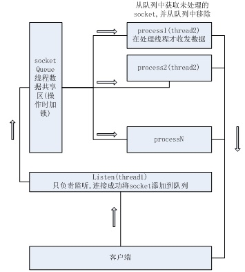
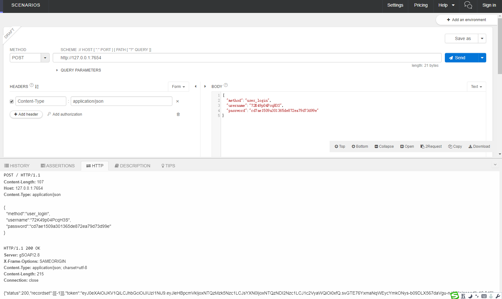

# gsoap PostgreSQL libpq高性能JSON服务器
[中文版](/README.md)<br/>
[英文版](/README_EN.md)<br/>

本项目已在Windows 10和Ubuntu 18.04中测试通过.

## 技术支持,提交BUG,志愿者
QQ群:578240280<br/>
email:81855841@qq.com<br/>

## 服务示例图


## 依赖的库
- [openssl](https://www.openssl.org/)
- [jansson](http://www.digip.org/jansson/)
- [pthread for windows](http://sourceware.org/pthreads-win32/)
- [libpq](https://www.postgresql.org/download/)

**windows编译库下载**<br/>
[openssl for windows](/OpenSSLx86.zip)<br/>
[jansson for windows](/jansson.zip)<br/>

**linux**
```bash
sudo apt-get install libjansson-dev;
sudo apt-get install libssl-dev;
sudo apt-get install  libpq-dev

#编译.注意可能要修改makefile文件的libpq头文件和库文件路径
make

#运行
./gservice
```

## 集成至项目的库
- gsoap 2.8.71 在目录gsoap中
- aec 在目录github中,加密解密PostgreSQL密码
- argparse 在目录github中,main.c命令行选项
- libjwt 在目录github中,生成或解析token,局部修改.

## 其它
[配置文件说明](doc/conf.md)<br/>
[内存管理和异常](doc/memory.md)<br/>
[服务请求结构体](doc/request.md)<br/>
[服务应答结构体](doc/response.md)<br/>
[PostgreSQL连接池](doc/postgreSQL.md)<br/>
[isolation](doc/isolation.md)<br/>
[libpq PQexecParams set Parameters](doc/Parameters.md)<br/>
[函数](doc/function.md)<br/>


目录结构<br/>
　　　|-core                         服务核心目录,不要修改里面的文件<br/>
　　　|-doc                          文档目录<br/>
　　　|-github                       本项目中使用来自github中的库<br/>
　　　|-gsoap                        gsoap生成的库,不要修改(gsoap 2.8.71)<br/>
　　　|-gsoap                        摘自PostgreSQL11中源码,本项目使用的库,不要修改<br/>
　　　|-sql                          测试方法中使用的PostgreSQL SQL表和函数<br/>
　　　|-conf.json                    配置文件<br/>
　　　|-main.c                       应用程序入口函数,运行后windows按esc退出,linux按ctrl+c退出.<br/>
　　　|-Makefile                     linux makefile<br/>
　　　|-se_handler.c                 请求处理方法实现,所有的请求方法都在这里.<br/>
　　　|-se_handler.h                 请求处理方法头文件<br/>
　　　|-se_method.h                   请求处理方法定义<br/>
　　　|-soapserver.vcxproj            VS2015工程文件<br/>
　　　|-soapserver.vcxproj.filters    VS2015工程文件<br/>
　　　|-soapserver.vcxproj.user       VS2015工程文件<br/>


## 示例
新建一个用户登录的方法,方法名为user_login<br/>
首先生成user_login的crc32代码<br/>
```bash
aescrypt -a user_login
#output 1221210184
```
打开se_method.h,添加一个宏,值为aescrypt -a user_login的输出
```c
#define SEM_USER_LOGIN								(1221210184)
```
新建se_users.h和se_users.c,分别定义和实现user_login方法.<br/>
```c
extern void user_login(struct SE_WORKINFO *arg);
```
```c
void user_login(struct SE_WORKINFO *arg) {
	struct SEPQ_EXECPARAMS *params = NULL;
	struct SE_PGITEM *pg;
	PGresult *result = NULL;

	const char *error = NULL;
	char *bin_result;
	int64_t userid;
	time_t current_tm;

	//获取请求的参数
	const char *username = (const char *)get_req_param_value(arg, "username", SOAP_TYPE__string);
	const  char *password = (const char *)get_req_param_value(arg, "password", SOAP_TYPE__string);

	//检查必填参数
	SE_request_arg_isnotset(username, arg, "username");
	SE_request_arg_isnotset(password, arg, "password");
	//获取一个只读的数据库连接,如果没配置只读数据库则使用读写数据库
	SE_send_conn_null((pg = get_dbserver(arg, false)), arg);
	//开始一个只读事务
	SE_throw(SEPQ_begin(arg, READ_COMMITTED_READ_ONLY));
	//创建sql
	resetStringBuilder(arg->sql);
	appendStringBuilder(arg->sql, "select * from test_users_login($1,$2)");
	//设置sql参数
	SE_throw(SEPQ_params_create(arg, 2, &params));
	SE_throw(SEPQ_params_add_varchar(arg, params, 0, username));
	SE_throw(SEPQ_params_add_varchar(arg, params, 1, password));
	//执行sql
	result = PQexecParams(pg->conn, arg->sql->data, params->count, params->types, (const char *const *)params->values, params->lengths, params->formats, 1);
	//输出查询结果
	SE_throw(SE_soap_generate_recordset(arg, result));
	//生成token
	bin_result = PQgetvalue(result, 0, 0);
	userid = (int64_t)pg_hton64(*((const uint64_t *)bin_result));
	current_tm = time(NULL);
	SE_throw(SE_make_token(arg, userid, current_tm, NULL));
  //清理资源
	SE_PQclear(result);
	//提交事务
	SE_throw(SEPQ_commit(arg));
	return;
SE_ERROR_CLEAR:
	SE_PQclear(result);
	//回滚事务
	SEPQ_rollback(arg);
	return;
}
```
打开se_handler.c,引用se_users.h,在user_process方法中的switch添加SEM_USER_LOGIN处理方法.<br/>
```c
#include "se_users.h"

case SEM_USER_LOGIN:
		user_login(arg);
		break;
```

