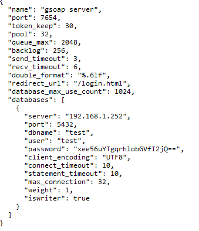
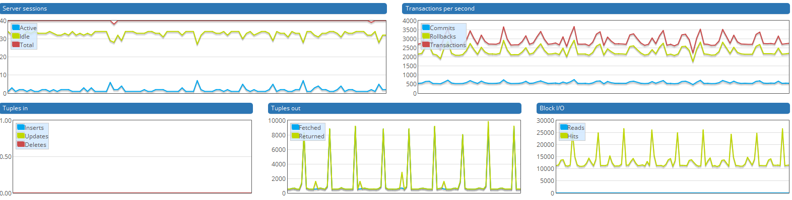
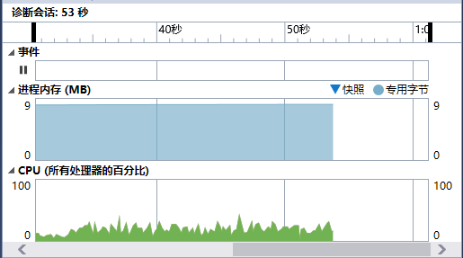
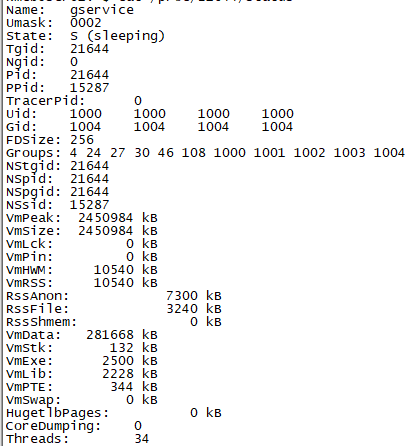
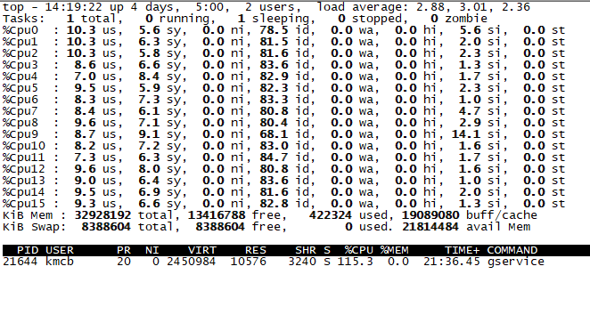
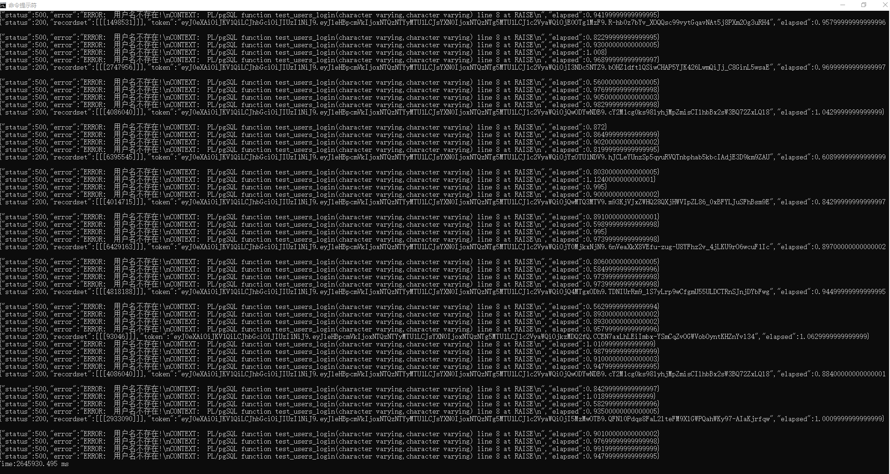

# gservice大规模测试

**测试环境**<br />
  　服务器1台: <br />
  　　cpu: 2 * Intel(R) Xeon(R) CPU E5530  @ 2.40GHz<br />
  　　memory:32GB <br />
  　　PostgreSQL 10.4 x16<br />
  　　操作系统:ubuntu 16.04 server<br />

  　普通计算机3台:windows 10 x64 ,windows 2008 x64 <br />
  　100MB局域网 <br />


## 1 导入测试数据
测试数据我已经生成,点击[下载测试数据](https://pan.baidu.com/s/1RKHaKNK2-ve5rtmO6a-r-w).下载解压后导入(注意修改脚本路径).测试数据共10000000条.
```bash
psql -h ip -U 用户名 -d 数据库 -f e:/test_users.sql
```
**顺便提一句,大规模数据中保证6-16纯数字随机组成的用户名唯一性还是有点难度的,需要好几轮检查修改才行,有兴趣的同学可以自己试试.**<br />
下载的测试数据中已经包含创建表和函数,因此不需要再执行下面的脚本.<br />
```sql
/****************************************************************************************
	用户表
	为了方便测试,用户名由6-16位数字组成,并且是唯一的
	密码固定为cd7ae1509a301365de872ea79d73d99e
	昵称或姓名由2-8位数字组成
	创建日期2018-01-01至2018-12-31 23:59:59.999999随机分布
drop table if exists test_users;
****************************************************************************************/
create table test_users(
	objectid bigserial not null,									--唯一编号
	uname varchar(16) not null,								--用户名,唯一,不能修改
	pwd varchar(64) not null,									--密码
	name varchar(8) not null,									--昵称或姓名
	generate timestamptz default now() not null,	--创建日期
	--实际使用中用户名只能是字母和数字组合
	--constraint ck_test_users_uname check(uname~'^[0-9a-zA-Z_]{4,16}$' and uname !~ '^[0-9]+$' ),
	constraint pk_test_users_objectid primary key(objectid) with (fillfactor=100)
)with (fillfactor=100);
create unique index uidx_test_users_uname on test_users(uname)  with (fillfactor=100);


/****************************************************************************************
	用户登录函数
	实际应用应加上限制,同一ip同一用户名3秒登录一次,防止暴力破解
drop function if exists test_users_login(varchar(16),varchar(64));
****************************************************************************************/
create or replace function test_users_login(
	iidentity varchar(16),ipwd varchar(64)
) returns bigint
as $$
	declare
		v_userid bigint;
		v_pwd text;
	begin
		select objectid,pwd into v_userid,v_pwd from test_users where uname=iidentity;
		if( v_userid is null or v_pwd is null ) then
			raise exception '用户名不存在!';
		end if;
		if( v_pwd != ipwd ) then
			raise exception '登录密码错误!';
		end if;		
		return v_userid;
	end;
$$ language plpgsql;
```
## 2 编译运行gservice
[下载gservice](https://github.com/kmblack1/gservice)
```bash
sudo apt-get install libjansson-dev libssl-dev libpq-dev
unzip gservice-master.zip
cd gservice-master
#编译前要修改makefile文件的libpq头文件和库文件路径
make
#运行前修改conf.json中的配置信息
./gservice -c 1
```

## 3 运行测试工具
[下载测试工具](https://github.com/kmblack1/client)<br />
测试工具每5次调用一次正确的用户名,其它情况用户名随机生成.
```bash
#linux
make
./client -u http://192.168.1.252:7654 -t 16 -n 100000
#windows,在cmd中直接切换到Release目录
chcp 65001
client -u http://192.168.1.252:7654 -t 16 -n 100000
```

## 4 gservice测试方法和消耗的资源
gservice和PostgreSQL在同一台ubuntu主机上,32线程,32连接.然后在另外三台windows计算机上分别运行client,每个client运行16个线程,调用十万次登录方法.<br />
<br />
windows client基本占用了客户机的所有cpu资源,内存占用3.2MB左右.<br />
client调用时PostgreSQL资源消耗情况,tps大约3500.(因为测试工具每5次调用一次正确的用户名,其它情况用户名随机生成.所以每5次回滚4次,提交一次)
<br />
查看gservice内存和cpu
```bash
#gservice pid 21644
cat /proc/21644/status

top -p 21644
```
**Windows**<br />
后来补截的图,只有一个客户端请求 16 * 10000
<br /><br />
**Linux**<br />




在调用过程中不要强行中止client,会导致内存泄露,linux可在gservice运行的终端按Ctrl+c或Ctrl+\ 停止服务,windows 按esc停止服务,同时客户端也自动停止.<br />
**如分开gservice和PostgreSQL分开部署,吞吐量会进一步提高.**

## 5 gservice每次请求处理时间
gservice平均每次响应时间1毫秒以下,共响应了3x1600000个请求(应减去网络通信时间和客户端显示数据时间).一个客户端远程调用了16x100000共耗时2645930.495ms(含网络通信),约44分钟左右.

